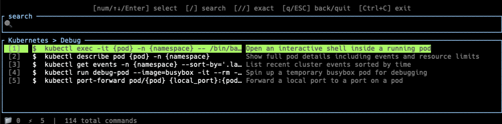

<div align="center">

# ⚡ sac — Save All Commands

**A terminal-native command manager that puts every command you know into a fuzzy-searchable TUI — and pastes it into your shell, never runs it.**

[](https://www.rust-lang.org/)
[](LICENSE)
[](#)
[](#)
[](#)
[](https://github.com/handsomevictor/save-all-commands/pulls)

[中文版 README](docs/README_CN.md)

</div>

---

<div align="center">

</div>

---

## What is sac?

**Navigate like Vim, reach any command in seconds.** No retyping, no scrolling through notes — type a few fuzzy characters, select by number, and the full command appears in your command-line buffer instantly, ready to tweak and run.

`sac` is a command manager with a fuzzy-searchable TUI. Select a command and it's pasted into your terminal input bar — never auto-executed. You stay in control of `{placeholder}` values and flags before pressing Enter.

Two scenarios where it saves you:
- You half-remember a `kubectl` command but not the exact flags — type a few chars, find it instantly, paste it.
- Your team's deployment scripts live in a Confluence doc — put them in `sac` once, accessible from any terminal in seconds.

---

## Comparison

| Capability | shell alias | history + fzf | Notion / docs | **sac** |
|---|:---:|:---:|:---:|:---:|
| Store commands with descriptions | alias name only | — | ✅ | ✅ |
| Hierarchical folder organization | ❌ | ❌ | manual | ✅ |
| Fuzzy search across all fields | ❌ | partial | ❌ | ✅ |
| **Paste into shell, never execute** | ❌ | ❌ | ❌ | ✅ |
| `{placeholder}` parameter support | ❌ | ❌ | ❌ | ✅ |
| Cross-shell support (zsh/bash/fish) | manual | manual | ❌ | ✅ |
| Remote sync / team sharing | ❌ | ❌ | ✅ | ✅ |
| Plain text, git-trackable | barely | ❌ | ❌ | ✅ |
| Fully offline | ✅ | ✅ | ❌ | ✅ |

> `fzf` + `history` is great — for commands you _have_ used. `sac` is for commands you _want_ to use but always forget.

---

## Installation

**Prerequisite:** Rust toolchain — install via [rustup](https://rustup.rs/) if needed.

```bash
git clone https://github.com/handsomevictor/save-all-commands.git
cd save-all-commands
cargo install --path .
```

Load example data and set up shell integration:

```bash
# Optional: copy the bundled example commands to get started immediately
mkdir -p ~/.sac
cp commands.toml.example ~/.sac/commands.toml

# Required for "paste into terminal" behavior
sac install
source ~/.zshrc   # or ~/.bashrc / ~/.config/fish/config.fish
```

Verify:

```bash
sac --version
```

> `cargo install` places only the binary in `~/.cargo/bin`. The `commands.toml.example` file must be copied manually from the cloned directory, or you can start fresh with `sac add`.

---

## Quick Start

```bash
sac          # open the TUI
```

**Browse mode** — navigate folders with number keys or arrow keys, press Enter to select.

**Search mode** — start typing anywhere to fuzzy-search all commands instantly.

| Input | Effect |
|---|---|
| Any characters | Fuzzy search across `cmd`, `desc`, `comment`, and `tags` |
| `/query` | Same as typing directly (vim-style activation) |
| `//query` | Exact substring search |
| `1`–`9` / `0` | Immediately select result at that position |
| `Esc` | Clear search, return to browse mode |
| `q` / `Esc` (browse) | Go up one folder level; exit at root |
| `Ctrl+C` | Exit without output |

When you select a command, it appears in your terminal input bar — ready for you to edit placeholders and run.

---

## Configuration

`sac` auto-creates `~/.sac/config.toml` on first run:

```toml
[general]
auto_check_remote = true   # check remote on daily first launch
last_check = ""

[commands_source]
mode = "local"             # "local" or "remote"
path = "~/.sac/commands.toml"
url  = ""                  # remote TOML URL (GitHub Gist, S3, etc.)

[shell]
type = "zsh"               # "zsh" / "bash" / "fish"
```

Modify without editing the file:

```bash
sac config set commands_source.mode remote
sac config set commands_source.url https://gist.githubusercontent.com/you/xxx/raw/commands.toml
sac config set general.auto_check_remote false
```

---

## commands.toml Format

`~/.sac/commands.toml` is a flat TOML file. Folders express hierarchy via a `parent` field; no nesting required.

```toml
[[folders]]
id     = "devops.k8s"
parent = "devops"
name   = "Kubernetes"

[[commands]]
id       = 1
folder   = "devops.k8s"
cmd      = "kubectl get pods -n {namespace}"
desc     = "List all pods in a namespace"
comment  = "Ensure the correct kubectl context is active first"
tags     = ["k8s", "pods"]
last_used = ""
```

**Constraint:** each folder may contain at most **10 items** (subfolders + commands combined), matching the `1`–`9` / `0` key layout.

---

## Search Ranking

| Priority | Rule |
|---|---|
| 1st | Any `tag` contains the query (case-insensitive) |
| 2nd | `cmd` field contains the query as a substring |
| 3rd | `desc` field contains the query as a substring |
| 4th | `comment` field contains the query as a substring |
| 5th | Weighted fuzzy score: `cmd×3`, `desc×2`, `comment×1`, `tags×1` |
| Tie-break | Most recently used first; then lower `id` first |

---

## CLI Reference

```bash
sac                              # Open TUI

sac add                          # Interactively add a command
sac add --folder <folder-id>     # Add to a specific folder

sac new-folder <name>                       # Create root folder
sac new-folder <name> --parent <folder-id> # Create sub-folder

sac edit <id>                    # Edit a command
sac delete <id>                  # Delete a command (with confirmation)

sac sync                         # Pull remote updates, show diff
sac sync --force                 # Overwrite local with remote (no prompt)

sac config                       # Show current config
sac config set <key> <value>     # Update a config value

sac where config                 # Print config file path
sac where commands               # Print commands file path

sac install                      # Write shell integration

sac export <path>                # Export commands.toml to path
sac import <path>                # Import from a TOML file
```

---

## Roadmap

- [ ] **Interactive placeholder filling** — prompt for `{namespace}`, `{pod}` etc. inside the TUI before pasting
- [ ] **Usage frequency scoring** — boost frequently-used commands in search ranking
- [ ] **Multiple command files** — mount personal + team command sets simultaneously
- [ ] **In-TUI editing** — edit commands without leaving the TUI
- [ ] **Color themes** — customizable TUI color schemes
- [ ] **Command history** — track edits, support rollback
- [ ] **Package manager distribution** — `brew install sac`, AUR, etc.

---

## Contributing

PRs and issues are welcome. Before submitting:

```bash
cargo test      # all tests must pass
cargo clippy    # zero warnings
```

---

## License

MIT License © 2026 [handsomevictor](https://github.com/handsomevictor)

See [LICENSE](LICENSE) for the full text.
