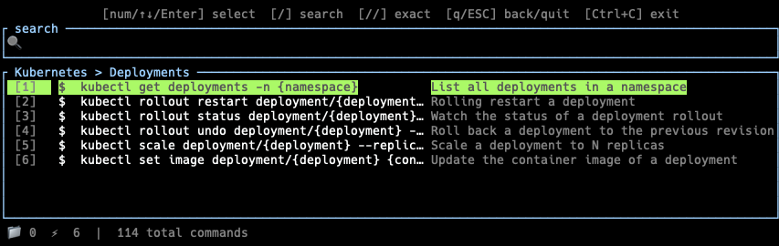

<div align="center">

# ⚡ sac — Save All Commands

**把你脑子里所有命令，装进一个 TUI**

[](https://www.rust-lang.org/)
[](LICENSE)
[](#)
[](#)
[](#)
[](https://github.com/handsomevictor/save-all-commands/pulls)

> 本项目由 [Claude Code](https://claude.ai/code) 从零开始编写

[English README](../README.md)

</div>

---

<div align="center">

</div>

<div align="center">

</div>


---

## 这是什么？

**像 Vim 一样导航，几秒内找到任意命令。** 不用重新输入，不用翻笔记——打几个字符模糊搜索，按数字选中，完整命令立刻出现在命令行输入框里，改好参数直接跑。

`sac` 是一个带模糊搜索 TUI 的命令管理器。选中命令后填入终端输入框——**不会自动执行**，你自己决定要不要改参数再跑。

两个典型场景：
- 记得有个 `kubectl` 命令但忘了完整写法——打几个字符，立刻找到，粘贴进输入框。
- 团队的部署脚本散落在 Confluence 文档里——统一录入 `sac`，任意终端几秒内取用。

---

## 与现有工具的对比

| 功能 | shell alias | history / fzf | Notion/文档 | **sac** |
|------|:-----------:|:-------------:|:-----------:|:-------:|
| 保存带描述的命令 | 仅 alias 名 | 无 | 有 | ✅ |
| 按分类/层级组织 | ❌ | ❌ | 手动 | ✅ |
| 模糊搜索命令内容 | ❌ | 部分 | ❌ | ✅ |
| **填入终端但不执行** | ❌ | ❌ | ❌ | ✅ |
| 支持 `{placeholder}` 参数 | ❌ | ❌ | ❌ | ✅ |
| 跨 shell 支持 | 需手动配置 | 需手动配置 | ❌ | ✅ |
| 远端同步/团队共享 | ❌ | ❌ | 有 | ✅ |
| 纯文本，可 git 管理 | 勉强 | ❌ | ❌ | ✅ |
| 完全离线可用 | ✅ | ✅ | ❌ | ✅ |

> `fzf` + `history` 是个很好的工具，但它只能搜索你**用过**的命令。
> `sac` 帮你管理那些你**想用、偶尔用、但总忘的**命令。

---

## 安装

**前置要求**：Rust 工具链（推荐通过 [rustup](https://rustup.rs/) 安装）

```bash
git clone https://github.com/handsomevictor/save-all-commands.git
cd save-all-commands
cargo install --path .
```

加载示例数据并配置 shell 集成：

```bash
# 可选：使用仓库自带的示例命令文件快速体验
mkdir -p ~/.sac
cp commands.toml.example ~/.sac/commands.toml

# 配置 shell 集成（强烈建议，否则选中命令只会打印到 stdout 而非填入输入栏）
sac install
source ~/.zshrc   # 或 source ~/.bashrc / source ~/.config/fish/config.fish
```

验证安装：

```bash
sac --version
```

---

## 快速上手

```bash
sac          # 进入 TUI
```

**浏览模式** — 用数字键或方向键在 folder 间导航，按 Enter 选中命令。

**搜索模式** — 直接打字即可实时模糊搜索所有命令。

| 输入 | 效果 |
|------|------|
| 任意字符 | 跨 `cmd`、`desc`、`comment`、`tags` 模糊搜索 |
| `/query` | 与直接输入效果相同（vim 风格激活） |
| `//query` | 精确子字符串搜索 |
| `1`–`9` / `0` | 直接选中对应编号的结果 |
| `Esc` | 清空搜索，回到浏览模式 |
| `q` / `Esc`（浏览） | 返回上一层；在根目录则退出 |
| `Ctrl+C` | 退出且不输出任何命令 |

选中命令后，命令文本出现在终端输入栏——你可以先修改占位符，再决定是否执行。

---

## 配置文件

`sac` 首次运行时自动创建 `~/.sac/config.toml`：

```toml
[general]
auto_check_remote = true   # 每天首次启动时自动检查远端更新
last_check = ""

[commands_source]
mode = "local"             # "local" 或 "remote"
path = "~/.sac/commands.toml"
url  = ""                  # 远端 TOML URL（GitHub Gist、S3 等）

[shell]
type = "zsh"               # "zsh" / "bash" / "fish"
```

无需手动编辑文件，直接用命令修改：

```bash
sac config set commands_source.mode remote
sac config set commands_source.url https://gist.githubusercontent.com/yourname/xxx/raw/commands.toml
sac config set general.auto_check_remote false
```

---

## commands.toml 格式

`~/.sac/commands.toml` 是一个扁平 TOML 文件，folder 通过 `parent` 字段表达层级关系。

```toml
[[folders]]
id     = "devops.k8s"
parent = "devops"
name   = "Kubernetes"

[[commands]]
id       = 1
folder   = "devops.k8s"
cmd      = "kubectl get pods -n {namespace}"
desc     = "列出指定 namespace 下的所有 pods"
comment  = "需要提前配置好 kubectl context"
tags     = ["k8s", "pods"]
last_used = ""
```

**层级约束**：每个 folder 最多 **10 个直接子项**（子 folder + command 合计），与 TUI 的 `1`–`9` / `0` 键位一一对应。

---

## 搜索权重说明

| 优先级 | 规则 |
|--------|------|
| 1 | 任意 `tag` 包含搜索词（大小写不敏感） |
| 2 | `cmd` 字段精确包含搜索词 |
| 3 | `desc` 字段精确包含搜索词 |
| 4 | `comment` 字段精确包含搜索词 |
| 5 | 加权模糊评分：`cmd×3`，`desc×2`，`comment×1`，`tags×1` |
| 同分 | `last_used` 越近越靠前；从未使用则 `id` 越小越靠前 |

---

## CLI 命令速查

```bash
sac                              # 进入 TUI

sac add                          # 交互式添加命令
sac add --folder <folder-id>     # 在指定 folder 下添加

sac new-folder <name>                       # 在根目录新建 folder
sac new-folder <name> --parent <folder-id> # 在子目录新建

sac edit <id>                    # 交互式编辑命令
sac delete <id>                  # 删除命令（二次确认）

sac sync                         # 检查远端更新，展示 diff
sac sync --force                 # 强制用远端覆盖本地（无需确认）

sac config                       # 显示当前配置
sac config set <key> <value>     # 修改配置项

sac where config                 # 显示配置文件路径
sac where commands               # 显示命令文件路径

sac install                      # 写入 shell 集成脚本

sac export <path>                # 导出 commands.toml
sac import <path>                # 从文件导入命令
```

---

## Roadmap

- [ ] **`{placeholder}` 交互式填值**：在 TUI 中对占位符弹出填写提示，直接生成完整命令
- [ ] **命令使用频率统计**：记录使用次数，在搜索排序中提升高频命令权重
- [ ] **多命令文件支持**：允许同时挂载多个 commands.toml（个人 + 团队）
- [ ] **TUI 内联编辑**：在 TUI 中直接编辑命令，无需跳出到 CLI
- [ ] **颜色主题支持**：支持自定义 TUI 配色方案
- [ ] **命令版本历史**：记录命令修改历史，支持回滚
- [ ] **包管理器分发**：支持 `brew install sac`、AUR 等

---

## 贡献

欢迎 PR 和 Issue。提交前请确保：

```bash
cargo test      # 全部通过
cargo clippy    # 零警告
```

---

## License

MIT License © 2026 [handsomevictor](https://github.com/handsomevictor)

完整授权文本见 [LICENSE](../LICENSE)。
